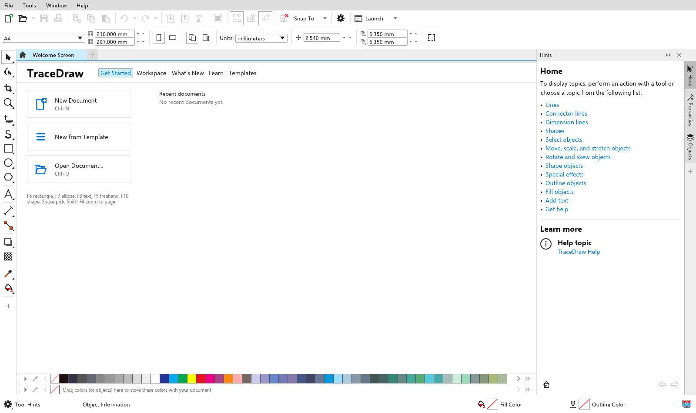
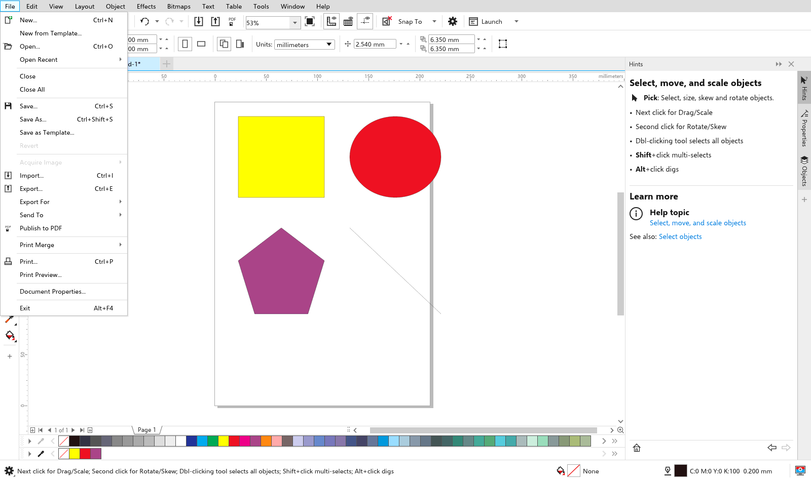
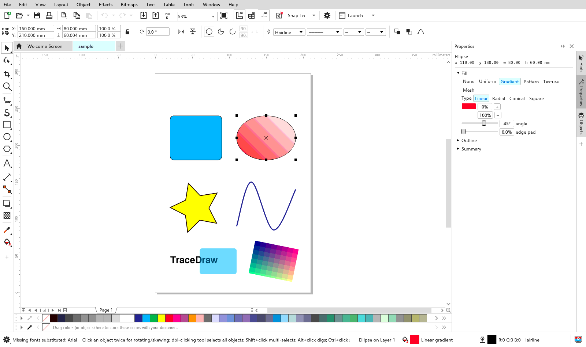
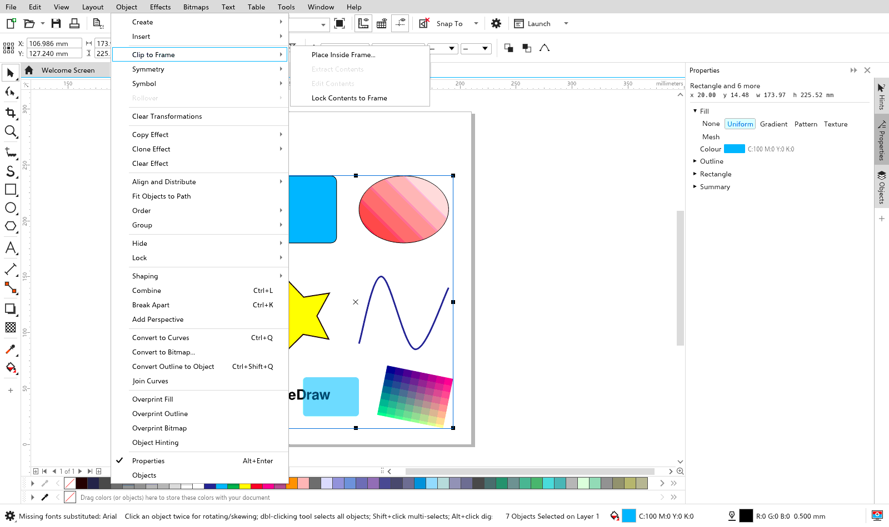
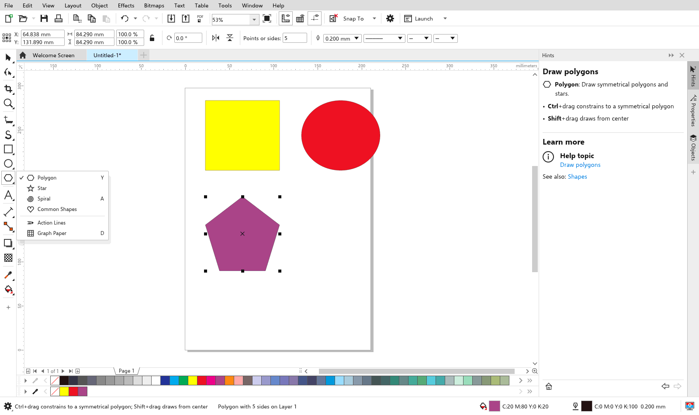
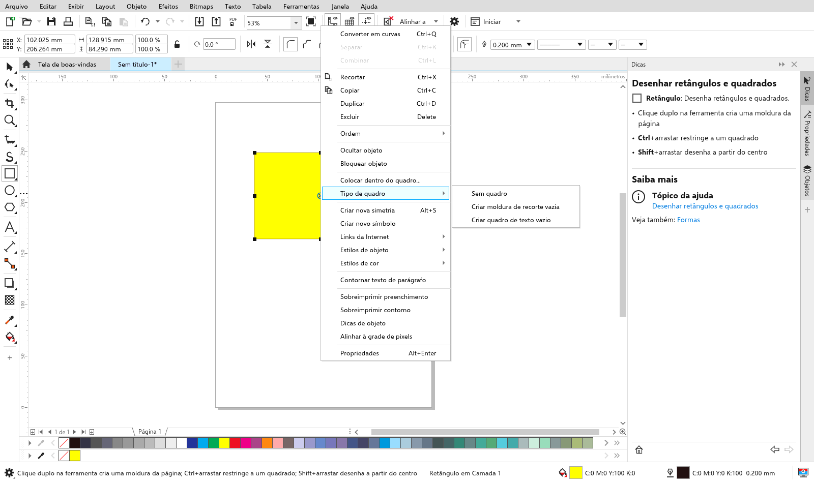
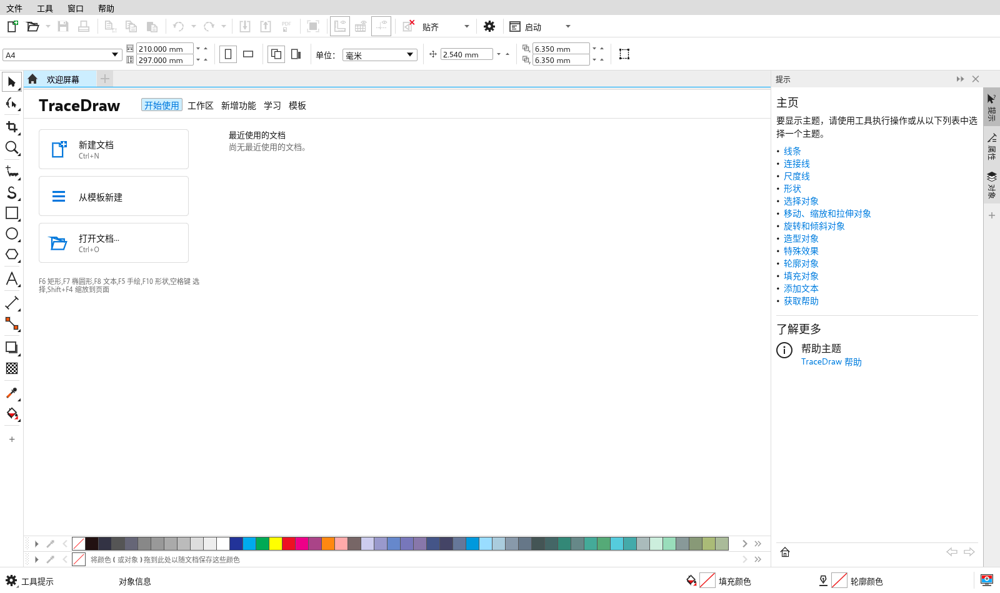
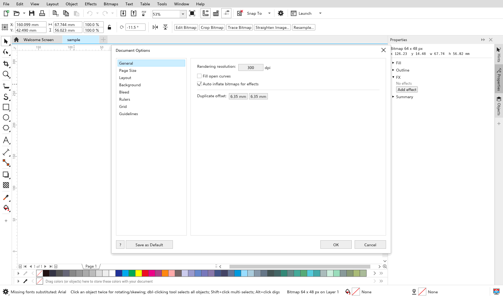

# TraceDraw

**An open-source vector illustration editor in pure Rust.** Pages, master
layers, curves, text with a full paragraph engine, tables, symbols, every
fill type (uniform, fountain, pattern, texture, mesh), live effects
(contour, blend, distort, envelope, perspective, extrude, bevel, block
shadow, lens, transparency), ClipFrame, bitmap effects and tracing, a
clean-room `.cdr` reader, SVG, PDF/AI, EPS, DXF, PSD and EMF/WMF import, SVG/PDF/EPS/DXF/EMF export, JavaScript
automation, a user interface in twelve languages, and a desktop workspace
built for people who already know how a professional vector editor is laid
out: menu bar, property bar, toolbox with flyouts, thirty dockers, colour
palette, rulers and a page navigator.

No Electron, no webview, no runtime: a single native binary (egui/eframe)
for Windows, macOS and Linux, plus a command-line tool for batch
conversion.

Status: **beta**. `docs/parity.md` lists every capability of the reference
editor and its state (78 working, 16 partial, 6 missing) and is the
measure of progress; `docs/blueprint-gaps.md` lists what is still open.

## Highlights

- **Document model**: multi-page documents, layers and master layers (all,
  odd, even), guides (horizontal, vertical, angled), rectangles, ellipses
  (pie, arc), polygons and stars, spirals, graph paper, action lines,
  common shapes, Bezier curves, artistic and paragraph text, text on a
  path, tables, groups, ClipFrame containers, symbols, bitmaps, page
  backgrounds, metadata.
- **Fills**: uniform in RGB, CMYK, Gray, HSB, HSL, Lab, YIQ and
  registration; fountain fills with any number of stops (linear, radial,
  conical, square); two-colour and bitmap patterns; procedural textures;
  mesh fills; area fill of enclosed regions.
- **Outlines**: width or hairline, caps, corners, dash patterns,
  arrowheads, calligraphic nib, behind-fill, scale-with-object, overprint.
- **Tools** (62, one icon each): Pick, Freehand Pick, Free Transform, Shape
  with full node editing (cusp, smooth, symmetrical, add, delete, join,
  break, extract, close, reduce, align, line and curve conversion, elastic
  mode), Smooth, Smear, Twirl, Attract, Repel, Smudge, Roughen, Crop,
  Knife, Segment Delete, Eraser, Zoom, Pan, Freehand, 2-Point Line,
  Bezier, Pen, B-Spline, Polyline, 3-Point Curve, Shape Recognition,
  Sketch, Brush Strokes (preset, brush, sprayer, calligraphic,
  expression), Rectangle and 3-Point Rectangle, Ellipse and 3-Point
  Ellipse, Polygon, Star, Spiral, Common Shapes, ActionLines, Graph Paper,
  Text, Table, five dimension tools, three connectors, Drop Shadow,
  Contour, Blend, Distort, Envelope, Extrude, Block Shadow, Transparency,
  two eyedroppers, Interactive Fill, Area Fill, Mesh Fill, Outline Pen
  and Outline Colour.
- **Text**: rustybuzz shaping from the system's fonts, paragraph layout
  with wrapping, justification, leading, indents, tabs, columns, bullets,
  drop caps, hyphenation, tracking, baseline shift, OpenType features,
  fit to frame, wrap around objects, spell check, find and replace,
  glyph browser, font manager with missing-font substitution.
- **Effects and colour**: live effects editable from their dockers,
  eleven lens types, transparency with merge modes, colour styles and
  harmonies, object styles, palettes and palette manager, proof colours,
  separations.
- **Bitmaps**: import of PNG, JPEG, BMP, GIF, TIFF, WebP; convert to
  bitmap; fifteen groups of bitmap effects; colour modes; colour mask;
  inflate; Bitmap tracing-style tracing (quick, centreline, outline, presets).
- **Files**: native `.tdraw` (JSON), `.cdr` reader (RIFF and ZIP
  containers, compressed streams, versions 7 through 2019), SVG, SVGZ,
  PDF, AI, EPS, DXF, PSD, EMF and WMF import, SVG, PDF, AI, EPS, DXF, EMF, HTML, PNG,
  JPEG, WebP, GIF, BMP and TIFF export,
  print to PDF, print merge from CSV, templates.
- **Automation**: JavaScript (boa) with an `Application`, `ActiveDocument`,
  `ActivePage`, `ActiveLayer`, `Shapes`, `Shape`, `Fill`, `Outline` and
  `Color` object model; macro recording produces scripts.
- **Workspace**: welcome screen, document tabs, context-sensitive property
  bar, thirty dockers, context menus, colour palette, rulers, guides,
  snapping (grid, pixel, baseline, guidelines, objects, page, dynamic),
  page sorter, full-screen preview, five workspaces, customisable
  shortcuts, Options dialog, settings persisted per user.
- **Languages**: English, Chinese (Simplified), Hindi, Spanish, French,
  Arabic (right-to-left layout), Bengali, Russian, Portuguese (Brazil),
  Indonesian, German and Japanese, with system fallback fonts for every
  script.

## Screenshots

| | |
|---|---|
|  |  |
|  |  |
|  |  |
|  |  |
|  | |

Captured with the headless driver in `scripts/visual/`.

## Install

Installers are built by GitHub Actions on every push to `main` and
published on the Releases page for `v*` tags:

| Platform | File |
|---|---|
| Windows | `tracedraw-<version>-windows-x86_64-setup.exe` (Inno Setup) and a portable zip |
| macOS | `tracedraw-<version>-macos-arm64.dmg`, `-macos-x86_64.dmg` (unsigned: right-click, Open) |
| Linux | `.deb`, `.AppImage`, tarball |

Packaging sources live in `packaging/`.

## Build from source

```sh
cargo run --release -p tracedraw                 # empty A4 document
cargo run --release -p tracedraw -- file.cdr     # open a file
cargo run --release -p tracedraw-cli -- convert in.cdr out.pdf
cargo test --workspace
```

Rust 1.80 or newer. On Linux the app needs X11 or Wayland, libxkbcommon
and Mesa.

## Architecture

```text
crates/core       document model, commands, undo engine, geometry (kurbo),
                  node editing, shaping, effects, styles, colour   (no UI deps)
crates/cdr        .cdr reader: container, RIFF walker, object parser
crates/text       font discovery (fontdb), shaping (rustybuzz), outlines
crates/render     CPU rasteriser (tiny-skia): fills, outlines, effects
crates/io         native .tdraw, SVG, PDF/AI, EPS, DXF, PSD and EMF/WMF import, SVG, PDF, EPS, DXF, EMF and HTML writers
apps/tracedraw    desktop app (egui/eframe), a thin shell over the engine
apps/tracedraw-cli  inspect, info, convert, icc, stress
docs/             architecture, decisions, behaviour notes, format notes,
                  parity, acceptance criteria, roadmap
```

Every user-visible change is a `Command` applied through the engine, which
is what gives undo/redo, the CLI and automation the same code path. See
`docs/architecture.md` for the full picture and `docs/decisions.md` for
the choices behind it.

## Documentation

| Document | What it covers |
|---|---|
| `docs/architecture.md` | crates, data flow, units, rendering, text |
| `docs/decisions.md` | stack, rendering, text, PDF, colour, licensing |
| `docs/parity.md` | every capability of the target design and its status |
| `docs/behavior/` | exact behaviour, defaults and formulas per tool |
| `docs/acceptance.md` | measurable acceptance criteria and performance targets |
| `docs/i18n.md` | user interface languages |
| `docs/blueprint-gaps.md` | what is still open against the reference feature inventory |
| `docs/cdr-format.md` | what the `.cdr` reader assumes and what is confirmed |
| `docs/roadmap.md` | milestones |
| `AGENTS.md` | rules for contributors and AI agents |

## Shortcuts

| Action | Keys |
|---|---|
| Pick / Shape / Zoom / Pan | Space, F10, Z, H |
| Freehand / Bezier / Rectangle / Ellipse / Polygon / Text | F5, B, F6, F7, Y, F8 |
| Interactive Fill / Eyedropper | G, flyout |
| Zoom to page / fit / selected | Shift+F4 / F4 / Shift+F2 |
| Undo / Redo | Ctrl+Z / Ctrl+Shift+Z |
| Group / Ungroup / Convert to curves | Ctrl+G / Ctrl+U / Ctrl+Q |
| Combine / Break apart | Ctrl+L / Ctrl+K |
| Cut / Copy / Paste / Duplicate | Ctrl+X / Ctrl+C / Ctrl+V / Ctrl+D |
| Order: front / back / forward / back one | Shift+Home / Shift+End / Ctrl+PgUp / Ctrl+PgDn |
| Align left/right/top/bottom/centre | L, R, T, B, E, C, P with a selection |
| Nudge | Arrows (Shift = 10x) |
| Open / Save / Import / Export | Ctrl+O / Ctrl+S / Ctrl+I / Ctrl+E |
| Options | Ctrl+J |

## Clean-room notice

TraceDraw is implemented from public documentation, published
reverse-engineering notes and observation of real files only. It contains
no code or assets from any other vector editor and is not affiliated with
any vendor. Licensed colour libraries and third-party content libraries
are deliberately not included; see `docs/decisions.md`.

## License

MIT or Apache-2.0, at your option.
